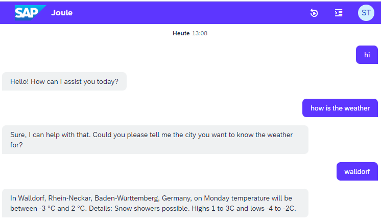

# joule-functions-example
This is a reference for an assistant build with the Joule Functions approach.

## Content

```
└── example_assistant/ // Assistant root
    ├── da.sapdas.yaml  // Assistant definition combining capabilities
    └── weather_capability/ // Capability root
        ├── functions // Root for functions
        ├── scenarios // Root for scenarios
        └── capability.sapdas.yaml // Capability definition with System Aliases
```


## Use-Cases

### Weather Fetching

Fetching weather for a city and returning a response based on scripting.




## Setup

Follow the following steps to setup the example assistant.
As a prerequisite you need to have all [prerequisite steps done as described](https://github.tools.sap/DAS-Samples/da-mc-developers-hands-on/tree/1-Setting-up-the-environment) resulting in the following steps achieved:
- Subaccount with subscription to Digital Assistant
- IDE Extension & CLI installed

### Destination

Create a destination with the following settings in your subaccount:

```properties
URL=https://api.weather.com/v3
Name=WEATHER
ProxyType=Internet
Type=HTTP
Authentication=NoAuthentication
```

Click on "New Property" to add the propery `URL.queries.apiKey` with value `c322ef22435d40bfa2ef22435df0bfbe`. This will automatically add the API Key as additional query parameter to all API calls.

### Compilation and Deployment

Run `sapdas deploy -c -n` to compile and deploy the assistant to your subaccount.
Check out [the initial guide for our CLI tool](https://github.tools.sap/DAS-Samples/da-mc-developers-hands-on/tree/4-Play-with-your-Digital-Assistant) for more information.


:information_source: Some steps of our [general starting guide](https://workzone.one.int.sap/site#workzone-home&/groups/bj5ax8gAxEkFxGXcO8EIWK/workpage_tabs/CJLmZVxErNiE8hM1ApNh1G) might be still relevant for you to get started.
