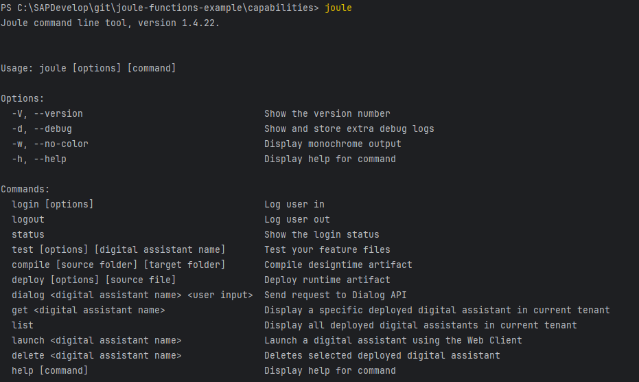
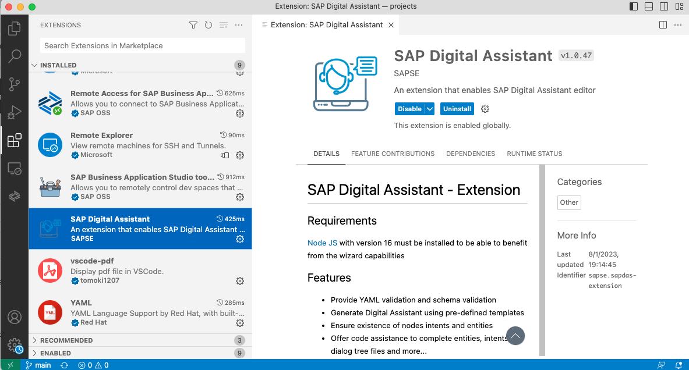

# Hello World - Step 1: Setting up the environment

In this step, we will install all the appropriate tools to make a Capability Developer Environment working.

## Preview



*The Joule Command Line Interface is running in your development environment*

## Prerequisite
- You have access to an SAP BTP account
- Visual Studio Code or a similar IDE is installed on your machine
- you are connected to the SAP Network

## Steps

### Onboard Joule to your BTP account

Go to your SAP BTP global account and run the Joule initial setup steps:
https://help.sap.com/docs/joule/service-guide/initial-set-up

In the subaccount where you set up Joule, go to `Instances & Subscriptions`and press on the Subscription `Joule`.
A message "The service is up and running." should appear. Joule is now ready to use.

### Install Joule IDE Extension

If you are using Visual Studio Code, follow the Joule IDE Extension installation guideline:
https://help.sap.com/docs/joule/service-guide/joule-ide-extension

Make sure that you see the IDE Extension in the plugin section:



### install Joule Command Line Interface (CLI) 

Follow the Joule Command Line Interface installation guideline:
https://help.sap.com/docs/joule/service-guide/sap-digital-assistant-command-line-interface

In short, install the Joule CLI by running the following command:

```npm install -g sapdas-cli --registry=https://int.repositories.cloud.sap/artifactory/api/npm/build-releases-npm```

Run the CLI command line tool by typing `joule` or `sapdas` in a shell:


* [Back to Overview](../index.md)
* [Continue with Step 2](../step2/index.md)

## Related Information 

[Joule Development Guideline](https://help.sap.com/docs/joule/service-guide/development)