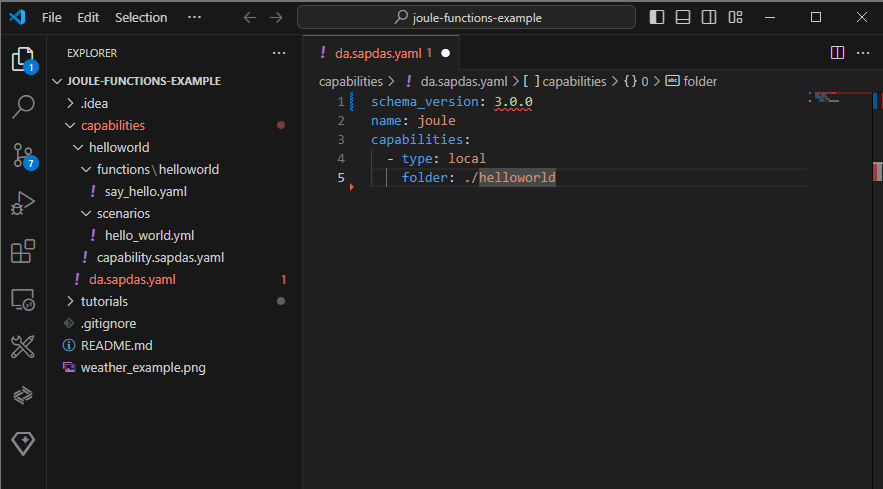

# Hello World - Step 2: Create a new capability

In this step, we will create a new digital assistant.

*Please note that the Joule IDE Extension does not support the latest schema and Joule functions yet. 
For the moment, we will manually create the needed assets and update the tutorial later on when this functionality is available.*  

## Preview


## Steps

### capabilities/da.sapdas.yaml (NEW)

```yaml
schema_version: 3.0.0
name: joule_assistant
capabilities:
  - type: local
    folder: ./helloworld_capability
```

1. Create a new folder in your project root directory and name it `capabilites`.
2. Add a new file `da.sapdas.yaml` in the newly created folder
2. set the schema version to `3.0.0`
3. set the name to `joule_assistant`
4. add a new capability of type `local` and set the folder to `./helloworld_capability`

### capabilities/helloworld/capability.sapdas.yaml (NEW)

```yaml
schema_version: 3.0.0

metadata:
  namespace: com.sap.das.demo
  name: helloworld_example_capability
  version: 1.0.0
  display_name: "Hello World Capability"
  description: >- 
   This capability says hello world.
```

1. Create a new subfolder in your `capabilites` folder and name it `helloworld`.
2. Add a new file `capability.sapdas.yaml` in the newly created folder
3. Copy the content above into the file


### Joule IDE Extension installation

If you use Visual Studio Code, follow the Joule IDE Extension installation guideline:
https://help.sap.com/docs/joule/service-guide/joule-ide-extension

Make sure that you see the IDE Extension in the plugin section:


### Joule Command Line Interface (CLI) installation

Follow the Joule Command Line Interface installation guideline:
https://help.sap.com/docs/joule/service-guide/sap-digital-assistant-command-line-interface

Run the CLI command line tool by typing `joule` or `sapdas` in a shell:



## Related Information 

[Joule Development Guideline](https://help.sap.com/docs/joule/service-guide/development)