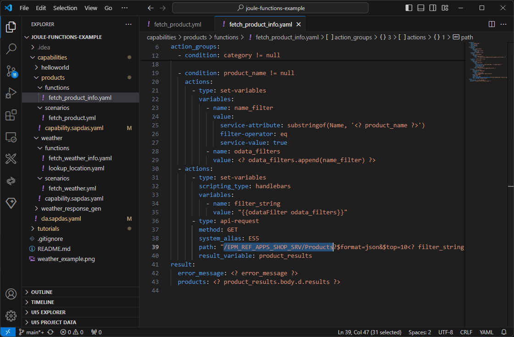

# Search Products - Step 3: Create the product search dialog function

This time, we integrate a more complex API that is able to search and filter for products using an OData service.

## Preview



*The project with the fetch product sdialog function added*

## Steps

We will now add the `fetch_products_info` function within the `functions` folder.

### capabilities/products/functions/fetch_product_info.yaml (NEW)

```yaml
parameters:
  - name: product_name
    optional: true
  - name: category
    optional: true
action_groups:
  - actions:
      - type: set-variables
        variables:
          - name: odata_filters
            value: []
  - condition: category != null
    actions:
      - type: set-variables
        variables:
          - name: odata_filters
            value: "<? odata_filters.append(validate_category_result.filter) ?>"

  - condition: product_name != null
    actions:
      - type: set-variables
        variables:
          - name: name_filter
            value:
              service-attribute: substringof(Name, '<? product_name ?>')
              filter-operator: eq
              service-value: true
          - name: odata_filters
            value: <? odata_filters.append(name_filter) ?>
  - actions:
      - type: set-variables
        scripting_type: handlebars
        variables:
          - name: filter_string
            value: "{{odataFilter odata_filters}}"
      - type: api-request
        method: GET
        system_alias: ES5
        path: "/EPM_REF_APPS_SHOP_SRV/Products?$format=json&$top=10<? filter_string != null ? '&$filter=' + filter_string : '' ?>"
        result_variable: product_results
result:
  error_message: <? error_message ?>
  products: <? product_results.body.d.results ?>
```

1. Create a folder `functions` in the `products` capability.
2. Create a file `fetch_product_info.yaml` in the `functions` folder of the `products` capability.
3. Copy the code above into the new file and analyze the configuration of the service call.

Let's break down the dialog function into its components: First, we have the two parameters which are both marked as optional. This means, the user can either specify a product to search for or a category to filter the results, or both. 
The first action simply defines an empty `odata_filters` array. As both parameters are optional, we add the corresponding filters to the array as needed.

In the two conditions below, we check if the user has provided a category or a product name. OData services require a `$filter` argument in a specific format to be passed to its endpoint.
If you like to know more about querying and filtering OData services, please have a look at the [OData tutorial](https://www.odata.org/getting-started/basic-tutorial/#queryData).

TODO: !!! explain `validate_category_result` helper function !!!

If a `product_name` has been specified, we set a search filter on the OData property 'Name' that will be later composed to the expression `substringof('Name', '<product_name>') eq 'true'`.
The `name_filter` helper variable is used to store the filter object for this configuration.

In the next action, we use the handlebars helper function `odataFilter` to convert and concatenate the filters in the correct format. The `filter_string` variable is used to store the final filter string.
Finally, we can call the ES5 `Products` OData endpoint with the result set limited to 10 items and the filter string appended to the URL and store the result in the `product_results` variable.

The final URL will look like this:
```/EPM_REF_APPS_SHOP_SRV/Products?$format=json&$top=10&$filter=substringof('Name', 'HT-1000') eq 'true'```

To get a better idea of the API response returned by the API, the following URL can be either called via Postman or directly in the browser: https://sapes5.sapdevcenter.com/sap/opu/odata/sap/EPM_REF_APPS_SHOP_SRV/Products?$format=json&$top=10&$filter=substringof(%27Name%27,%27HT-1000%27)%20eq%20%27true%27

As the `result` for this function, we simply pass the array of products and an error message. We do not implement error handling in this tutorial, but you can extend the dialog function with error handling as needed.

## Summary

We have now added the dialog functions to the external API to our project and are ready to test it in the next step.
The overall project structure should look like this:

```
└── capabilities/ // assistant root
    ├── helloworld... 
    └── products/ // products capability
        ├── functions/ // root for functions
            └── fetch_product_info.yaml // product search function 
        ├── scenarios/ // root for scenarios
            └── fetch_products.yml // products scenario
        └── capability.sapdas.yaml // capability definition
        └── weather... // weather capability
    └── da.sapdas.yaml  // assistant definition combining capabilities
```

* [Back to Overview](../index.md)
* [Continue with Step 4](../step4/index.md)

## Related Information 

[Dialog Functions](https://help.sap.com/docs/joule/service-guide/dialog-functions)
