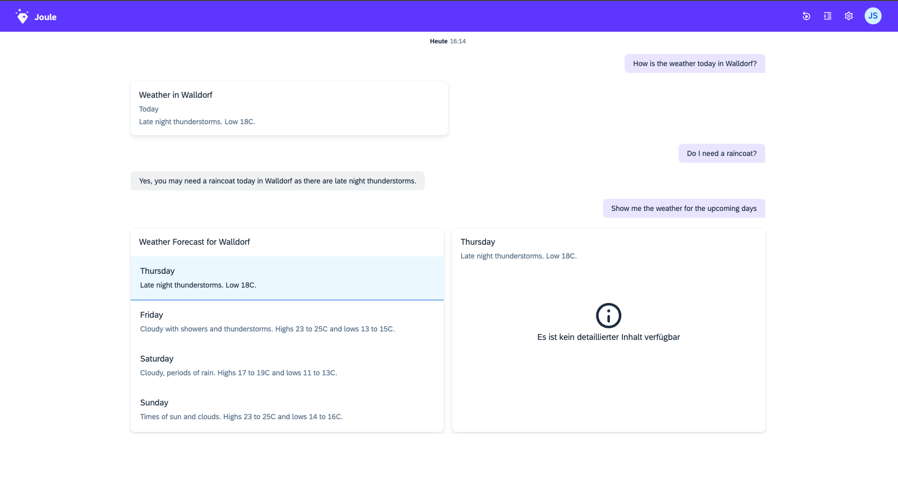

# Fetch Weather - Step 5: Add response generation to your weather scenario

In this step, we will remove the static messages in our assistant and enable dynamic and intelligent responses via GenAI response generation.

## Preview



*Our assistant is now capable of generating a response of various types specifically catered to the user utterance.*

## Steps

### Add a result to your 'fetch_weather_info' dialog function

Before we come to the actual response generation in the weather scenario, we will remove the static responses in the dialog function and expose the relevant parts of the weather api response as result variables.

#### capabilities/weather/functions/fetch_weather_info.yaml

```yaml
parameters:
  - name: city
action_groups:
  - actions:
      - type: set-variables
        scripting_type: spel
        variables:
          - name: unit
            value: m
      - type: dialog-function
        name: lookup_location
        parameters:
          - name: city
            value: "<? city ?>"
        result_variable: weather_location
      - type: api-request
        method: GET
        system_alias: WeatherService
        path: /wx/forecast/daily/3day?placeid=<? weather_location.placeid ?>&units=<? unit ?>&language=en-US&format=json
        result_variable: weather_result
result:
  timestamp: <? weather_result.body.validTimeLocal ?>
  temperatureMax: <? weather_result.body.temperatureMax ?>
  temperatureMin: <? weather_result.body.temperatureMin ?>
  dayOfWeek: <? weather_result.body.dayOfWeek ?>
  narrative: <? weather_result.body.narrative ?>
  city: <? city ?>
```

### Add a response context to your 'fetch_weather' scenario

In order to enable genai response generation, we will add a response context section to our weather scenario. In the response context, we can reference the subset of result variables in the target function that shall be used for response generation. Additionally, we will add one description per variable which explains its meaning to the LLM. The more accurate this description is, the better the results of the generated responses will be.

#### capabilities/weather/functions/fetch_weather_info.yaml

```yaml
description: This function fetches the weather for a given city and provides intelligent responses to weather related topics

slots:
  - name: city
    description: Weather information fetched for this city

target:
  type: function
  name: fetch_weather_info

response_context:
  - value: timestamp
    description: timestamp for next 4 days including today
  - value: temperatureMax
    description: maximum temperature for next 4 days incl. today
  - value: temperatureMin
    description: minimum temperature for next 4 days incl. today
  - value: dayOfWeek
    description: day of the week for next 4 days incl. today
  - value: narrative
    description: weather description for next 4 days incl. today
  - value: city
    description: city for which the weather has been fetched
```

### Test your assistant in the standalone web client:

1. Run the following command to open the standalone web client:
```bash
joule launch weather
```
2. A Browser will open with the joule web client. You can now test your assistant in the chat window.
3. Play around with the intelligent and dynamic responses of your assistant. You may use utterances like "How is the weather today in Walldorf?", "Do I need a raincoat tomorrow?" or "Show me the weather for the upcoming days". Notice how we get a variety of responses for the same scenario depending on what exactly we want to know.

That's a wrap! You have successfully completed the Joule Weather tutorial.

* [Back to Overview](../index.md)

## Related Information 

[Test the capability](https://help.sap.com/docs/joule/service-guide/test-capability)
